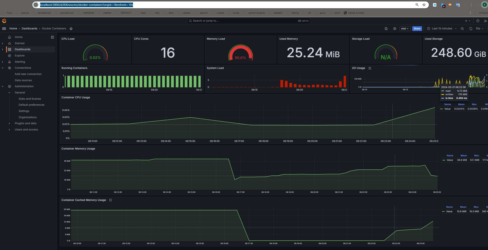

# el-q
The automation is implemented using Python3.10, pytest, WebDriver and Chrome.

## Objective
Your task is to create a script in Bash or Python that monitors and logs the CPU, RAM, and Disk IO usage throughout the startup period of the Qdrant vector database. This database should be initialized with a pre-existing dataset (for instance, one from this list: https://qdrant.tech/documentation/datasets/#available-datasets, although smaller datasets are also acceptable).


Your script must generate a chart that displays the resource usage over time, from the start to the end of the database's startup process. The end of the process can be determined either by a specified timeout parameter or by the script being stopped manually.


The test task should be submitted as a GitHub repository. This repository should include detailed instructions for installing dependencies, running the script, and examples of the results produced by the script.


The use of any external, open-source tools is permitted.

## Solution

Use a stack: docker + node-exporter + cadvisor + prometheus + grafana to monitor the selected metrics. 

## How to Run

### Prerequisites

* Docker
* Docker Compose

Note that you'll need to download a snapshot from the list mentioned above. I have used Arxiv Titles.

### Monitoring
From project root run:
```shell
wget -O arxiv_titles-3083016565637815127-2023-05-29-13-56-22.snapshot https://snapshots.qdrant.io/arxiv_titles-3083016565637815127-2023-05-29-13-56-22.snapshot
docker compose up -d
```

or use a Makefile command:
```shell
make monitor
```

The expected stdout looks like:
```shell
[+] Building 0.0s (0/0)                                                                                                                                                                                                                                                                                 docker:default
[+] Running 5/5
 ✔ Container monitoring_node_exporter  Started                                                                                                                                                                                                                                                                    0.0s 
 ✔ Container monitoring_qdrant         Started                                                                                                                                                                                                                                                                    0.0s 
 ✔ Container monitoring_cadvisor       Started                                                                                                                                                                                                                                                                    0.0s 
 ✔ Container monitoring_prometheus     Started                                                                                                                                                                                                                                                                    0.0s 
 ✔ Container monitoring_grafana        Started   
```

Now Grafana Dashboard is available on http://localhost:3000. Go to Dashboards -> Containers Dashboard and check out the metrics.


Note that the increase in I/O Usage|CPU Usage|Mem Usage marks the start of Qdrant initialization with a snapshot.
